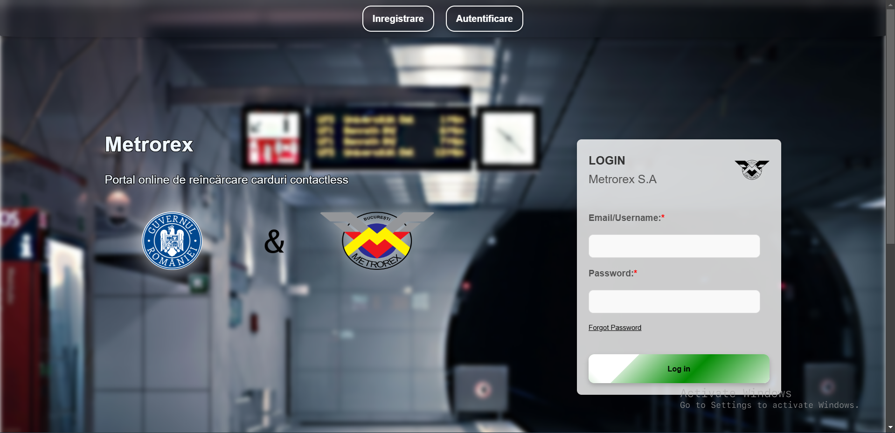

# Metrorex Online Card Purchase - Remake ⏎💳

## ⭐ Overview

Welcome to the **Metrorex Online Card Purchase Application**! This project is a complete modern remake of the existing Metrorex card purchasing platform, designed to offer an optimized, user-friendly, and secure experience. By leveraging modern web technologies and a scalable infrastructure, the application ensures smooth and seamless transactions for users.

## ⭐ Features

### 📱🖥️ Responsive Design
- Fully optimized for a wide range of devices, ensuring an excellent user experience on both desktop and mobile platforms.

### 🧑‍💻 User-Friendly Interface
- Simplified navigation with an intuitive layout designed for ease of use.
- Accessible features tailored to enhance user interaction.

### ⚡ Fast Load Times
- Implemented modern performance optimizations to ensure quick access and low latency during use.

### 🔒 Secure Transactions
- Robust integration with secure and trusted payment gateways to ensure transaction safety.
- Adherence to security best practices to protect user data.

### ☁ Firebase Hosting
- Scalable backend infrastructure with Firebase for reliable hosting and deployment.

## ⭐ Laptop/PC Gallery

The application includes a laptop/PC gallery showcasing a comprehensive visual representation of its design and functionality. This section serves as a reference for developers and contributors to understand the current state of the platform and its capabilities.

## ⭐ Technologies Used

- **HTML 🌐**: Provides the structure and backbone of the web pages.
- **CSS 🎨**: Enhances styling, layout, and visual aesthetics.
- **JavaScript ✨**: Powers interactive elements and adds dynamic functionality.
- **Firebase 🚀**: Used for hosting, database management, and scalable deployments.

## ⭐ Usage

### 🛒 Purchase a Card
- Navigate to the "Card Purchase" section.
- Select your preferred card type.
- Complete the payment process seamlessly.

### 🕌 View Transaction History
- Access the "User Profile" section to view your detailed transaction history.
- Monitor and manage your account activity effortlessly.

  
## ⭐ PC/Laptop Gallery min res 1240px




## ⭐ Contributing

We welcome contributions from the community to enhance the functionality and user experience of this application. Follow the steps below to contribute:

1. **Fork the Repository**: Create your own copy of the repository.
2. **Create a Branch**: Make a new branch for your feature or bug fix.
   ```bash
   git checkout -b feature-name
   ```
3. **Make Changes**: Implement your feature or fix the issue.
4. **Commit Changes**: Write meaningful commit messages to explain your updates.
   ```bash
   git commit -m "Add feature X"
   ```
5. **Push to Your Fork**: Push the branch to your forked repository.
   ```bash
   git push origin feature-name
   ```
6. **Submit a Pull Request**: Create a pull request with a detailed description of your changes.

## ⭐ License

This project is licensed under the **MIT License**. Refer to the [LICENSE](LICENSE) file for detailed information.

## ⭐ Contact

For any inquiries, feedback, or support, please reach out to us at:
- **Email**: [mihaiflavius_27@yahoo.com](mailto:mihaiflavius_27@yahoo.com)

---

Thank you for using the **Metrorex Online Card Purchase Application**! 🙌 Your feedback and support help us improve and provide an exceptional experience.
